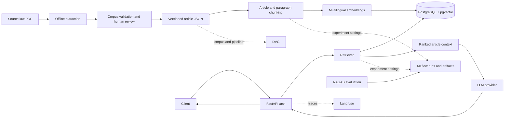

# High-Level Design

**Status:** target design for the Egyptian Civil Code RAG Project 2. The extraction stage exists; the query service and serving stack are planned and are not implemented yet.

## Goals

- Answer questions in Arabic or English from one bilingual corpus: the Egyptian Civil Code.
- Ground every answer in retrieved provisions and return article citations that a reader can verify.
- Keep extraction, indexing, serving, and evaluation reproducible and separately observable.
- Start locally without a GPU, then add the course's serving and optimization stages without changing the corpus contract.

## System context

## Components and ownership

| Component | Responsibility | Initial choice |
|---|---|---|
| Corpus builder | Read the two-column PDF, preserve language and hierarchy, emit article records, and report gaps | PyMuPDF cell extraction; no OCR for the supplied native-text PDF |
| Corpus review | Verify record numbers, Arabic text, repeal labels, citations, and representative source pages | Markdown/JSON review artifacts plus a human-reviewed sample |
| Ingestion | Validate records, create deterministic article-level chunks, embed by language, and load an index version | Offline CLI; start with one multilingual embedding model |
| Vector store | Store vectors and article metadata; apply scope/repeal filters and return source articles | PostgreSQL with pgvector for the first deployed slice |
| Query API | Validate requests, retrieve context, call generation, and format citations | FastAPI, Pydantic request/response schemas |
| Generation | Write an answer using only retrieved provisions; abstain when evidence is insufficient | Hosted API model first; vLLM is a later offline-serving option |
| Evaluation | Measure retrieval and answer quality on Arabic/English questions | RAGAS; version question sets and results; track configurations in MLflow |
| Observability | Trace request, retrieval, prompt, model, latency, and token/cost data | Langfuse; do not record secrets or unnecessary user data |
| Delivery | Reproduce, validate, build, and run the service | uv + lockfile, GitHub Actions, Docker, Docker Compose for local review |

The first service is a modular monolith. The corpus has about 1,149 article identifiers and does not need a queue or a separate indexing service to establish the project. Ingestion is an offline command; the HTTP process handles queries and health checks.

## Request flow

1. A client sends a non-empty question to `POST /ask`.
2. The API validates the request and determines the query language without changing the legal text.
3. The retrieval layer embeds the query, searches both language variants, applies corpus/scope filters, and removes duplicate hits by article number.
4. The prompt builder includes the retrieved provisions with their article numbers and repeal status. It does not expose chunk IDs as citations.
5. The generation layer returns an answer in the requested language and a citation for each supporting article. If retrieval does not meet the evidence threshold, it returns an abstention with no unsupported legal claim.
6. Langfuse records spans for retrieval and generation. RAGAS evaluation runs offline against a versioned bilingual question set; its scores are attached to an MLflow run.

`GET /health` reports whether the API and vector store are ready and how many article records are indexed. It is used by Docker health checks and deployment readiness checks.

## Data and versioning

- The source PDF and derived corpus are data artifacts, not Python source files. The intended course workflow is to version them with DVC and reproduce extraction/indexing with `dvc repro`.
- The source PDF is excluded from Git and stored in the IDrive e2 DVC remote configured in `.dvc/config`; access keys stay in each contributor's Git-ignored `.env`. The current JSON and Markdown exports are Git review artifacts so this branch can be inspected without DVC credentials.
- A corpus fingerprint is derived from the source checksum, extractor version, and normalization/schema version. Index records carry that fingerprint and the embedding model identifier.
- Preserve repealed articles and mark them. Retrieval must not silently erase the evidence that a provision has been repealed.

## Deployment path

### Local review

Use Docker Compose for the API and PostgreSQL/pgvector. Build the vector index from the reviewed corpus before starting the API. The first model call can use a hosted LLM API so no GPU is required. Secrets enter through environment variables or a local ignored `.env` file; none are baked into the image.

### CI and image delivery

On pull requests, GitHub Actions installs the locked uv environment, runs lint and focused tests, validates the committed corpus contract, and builds the container. After the RAG evaluation set exists, CI also enforces its faithfulness threshold. On the protected main branch, the workflow can publish the image to a container registry and record the corpus/model versions used.

### Production-shaped deployment

Run the API container behind a TLS-terminating reverse proxy or managed ingress. Use a managed PostgreSQL instance with pgvector, persistent backups, and a secret store. Build and promote immutable images; run health/readiness checks before receiving traffic. Re-index as a separate, versioned release step and switch the active corpus version only after validation. The initial target is one API replica; add replicas after load measurements.

### Course extensions

Add Langfuse, MLflow, and RAGAS workflows, and extend the existing DVC pipeline with an indexing stage, as the corresponding course milestones are implemented. The final serving stage can wrap the RAG service with BentoML and serve an offline quantized model through vLLM. Keep those as explicit later stages so local extraction and the first API do not depend on GPU infrastructure.

## Project 2 delivery map

| Stage | Required evidence |
|---|---|
| Corpus | One structured record per article; 20 visually checked Arabic/English articles; repeal flags; source PDF and corpus versioned with DVC |
| Package and API | Installable `src/` package; `POST /ask`; empty question returns 422; `/health` reports indexed document count |
| Experiments | At least five MLflow runs comparing chunk size, overlap, embedding model, and RAGAS faithfulness; register the selected configuration |
| Serving | Docker image and Compose stack; BentoML wrapper, vLLM generation, streamed `/ask`; Locust run at 50 concurrent users |
| Optimization | AWQ 4-bit model and re-ranker distillation; report RAGAS before/after and keep faithfulness drop within 0.03 |
| Monitoring and safety | RAGAS on at least 50 questions; Langfuse trace for each request; retrieval drift and token-cost metrics; Grafana panels and faithfulness alert; PII and prompt-injection guardrails |
| Delivery | GitHub Actions lint/test/index/build/publish pipeline; CI faithfulness gate at 0.75 on a fixed 20-question subset; deployment and canary steps documented |

The handbook uses several evaluation-set sizes (20 for CI, 30 for the Module 5 scorecard, 50+ for monitoring). Use one reviewed 50+ question bilingual set, reserve a stable 20-question CI subset, and keep a separate 20-item hand-labeled subset for calibrating the LLM judge. Project 2's endpoint is `/ask`; the generic `/predict` rubric examples belong to other project tracks.

## Non-goals for this slice

- General-purpose ingestion of arbitrary uploaded PDFs or additional jurisdictions.
- OCR of scanned pages; the supplied 170-page source has a native text layer.
- User accounts, multi-tenancy, document upload, async queues, or a frontend.
- Claims that the current extraction is legally complete or that generated answers replace legal review.
